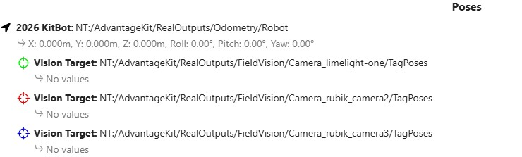
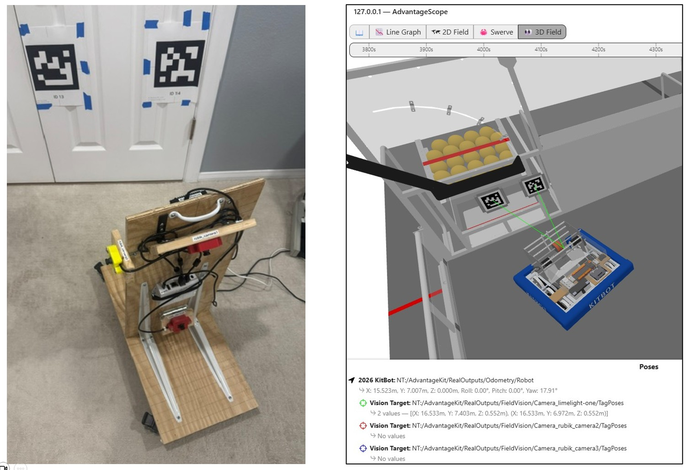
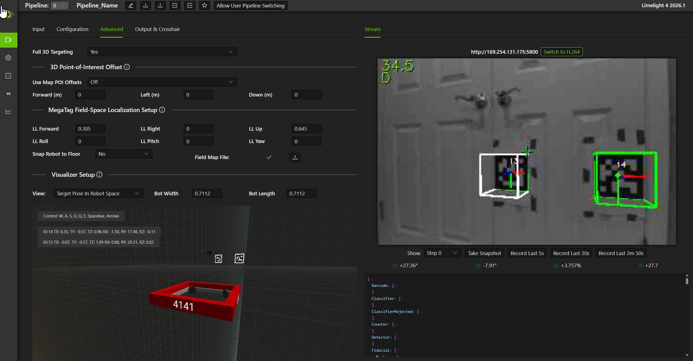
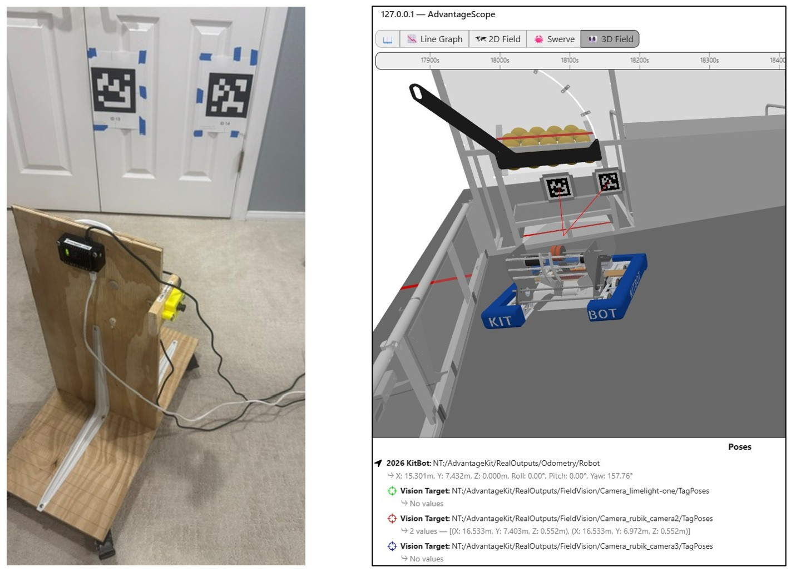
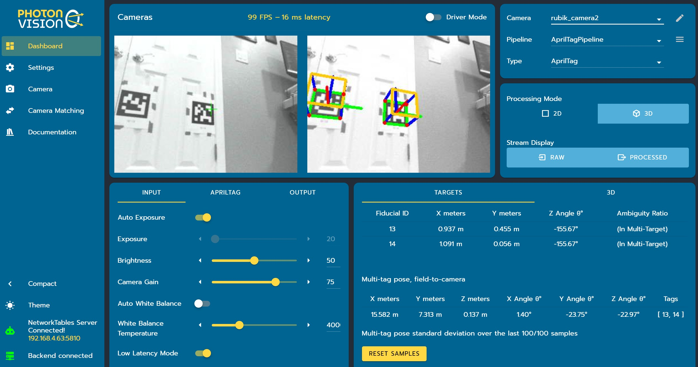

# Hardware-in-the-Loop: Field Vision

This section describes how to run an AdvantageScope simulation session using real vision devices on a test board connected to your laptop to detect apriltags. This enables the robot's position and orientation on the field to be estimated accurately and displayed in AvantageScope.
>Make sure that all of the [setup](hil-setup.md) has been completed first.

## Start Simulation

1. Start the simulation session. [Click here for detailed instructions on startup.](../simulation-framework/advantagescope.md#simulation-startup)
2. In AdvantageScope, use the `2D Field` and/or `3D Field` tab to view the location of the robot and lines of sight to april tags on the field. [Click here for instructions on how visualize the poses of the robot and apriltag vision targets.](../simulation-framework/advantagescope.md#simulating-field-location)
3. Make sure that the displayed poses in AdvantageScope correspond to the vision devices installed on your test board. Below are the poses that correspond to the test board [described earlier.](..//hardware-in-loop/hil-setup.md#test-board-and-targets) The green vision target is for the Limelight; the red and blue are for Rubik cameras.  

## Limelight
See below for an example of hardware-in-the-loop where the Limelight detects apriltags. The picture on the left shows the front of the test board pointing toward apriltags. The picture on the right shows how it is simultaneously simulated in AdvantageScope: apriltags 13 and 14 are detected (green lines) and the robot's odometry is updated to position the robot correctly relative to those tags. Note that the "robot" position and orientation are similar in both pictures. As the test board is moved, the graphical view in AdvantageScope is updated. 

While simulating with real Limelight devices on a test board, you have access to all of the normal capabilities presented in the Limelight web client: 

### Troubleshooting

If the Limelight device is not detected, double check your [Limelight setup](../hardware-in-loop/hil-setup.md#limelight-settings). Most likely problems are:

- `Custom NT Server` ip address is wrong
- Firewall issue
- Full 3d targeting is not turned on

## Rubik / PhotonVision
See below for an example of hardware-in-the-loop where the Rubik / USB cameras detect apriltags. The picture on the left shows the back of the test board pointing toward apriltags. The picture on the right shows how it is simultaneously simulated in AdvantageScope: apriltags 13 and 14 are detected (red lines from USB#1) and the robot's odometry is updated to position the robot correctly relative to those tags. Note that the "robot" position and orientation are similar in both pictures. As the test board is moved, the graphical view in AdvantageScope is updated. 

While simulating with real Rubik / PhotonVision cameras on a test board, you have access to all of the normal capabilities presented in the PhotonVision dashboard: 

### Troubleshooting

If the PhotonVision devices are not detected, [double check your Rubik / PhotonVision setup](../hardware-in-loop/hil-setup.md#photonvision-settings). The most likely problem is that the NetworkTables Server is not connected. If that is the case, you will see the following in the Settings tab of the PhotonVision dashboard. 
