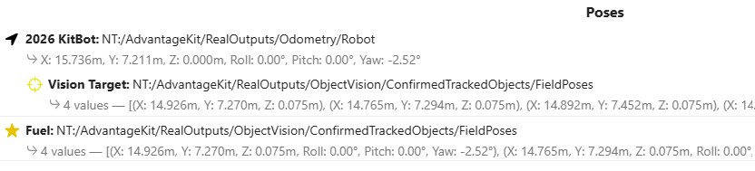
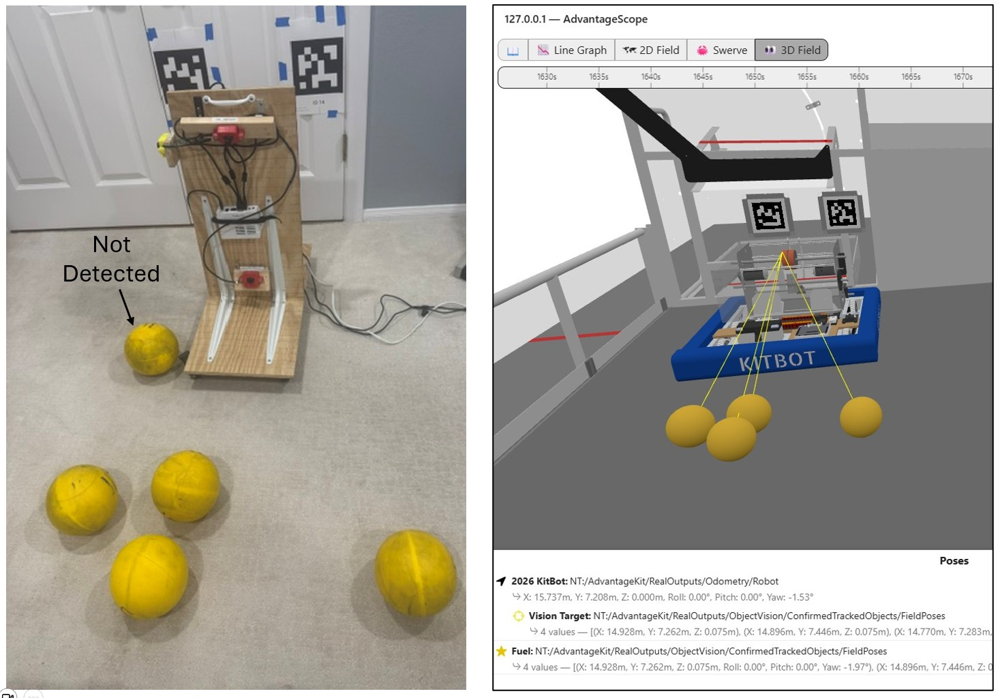
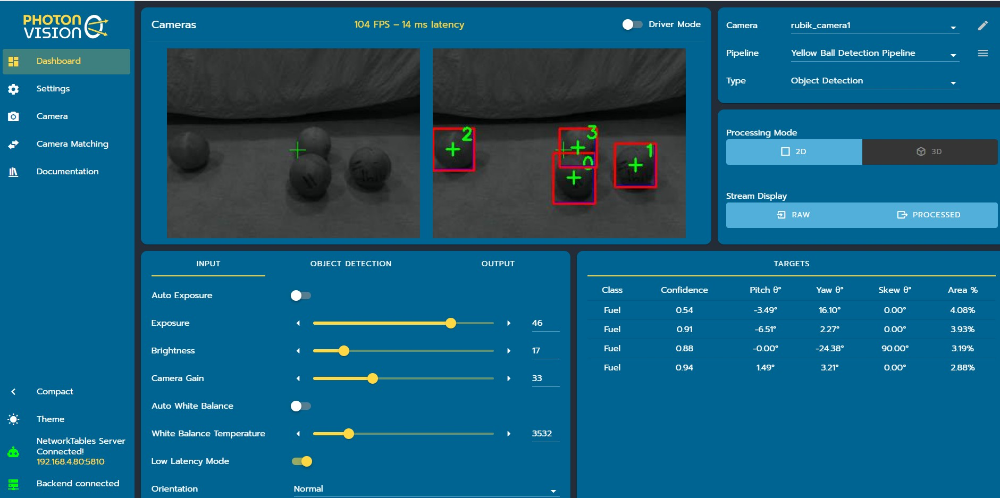

# Hardware-in-the-Loop: Object Detection

This section describes how to run an AdvantageScope simulation session using real vision devices on a test board connected to your laptop to detect objects such as the fuel balls from the 2026 season.
>Make sure that all of the [setup](hil-setup.md) has been completed first.

## Start Simulation

1. Start the simulation session. [Click here for detailed instructions on startup.](../simulation-framework/advantagescope.md#simulation-startup)
2. In AdvantageScope, use the `2D Field` and/or `3D Field` tab to view the location of the robot and lines of sight to detected objects. [Click here for instructions on how visualize the poses of the robot and object vision targets.](../simulation-framework/advantagescope.md#simulating-object-detection)
3. Make sure that the AdvantageScope displays the poses of the robot and detected objects as shown below. Notice that the `RealOutputs/ObjectVision/ConfirmedTrackedObjects/FieldPoses` fields are included twice: a) subordinate to the KitBot with type `Vision Target` which are displayed as yellow lines; and b) same level as KitBot with type `Fuel` game piece which are displayed as spheres.  

## Rubik / PhotonVision
See below for an example of hardware-in-the-loop where a Rubik / USB camera detects objects. The picture on the left shows the back of the test board surrounded by five fuel balls on the floor. The picture on the right shows how it is simultaneously simulated in AdvantageScope: four of the five balls are detected, with yellow lines of sight displayed from the camera to the detected objects. Note that the relative positions of the detected balls are similar in both pictures. As the test board is moved, the graphical view in AdvantageScope is updated. 

While simulating with real Rubik / PhotonVision cameras on a test board, you have access to all of the normal capabilities presented in the PhotonVision dashboard: 

### Troubleshooting

If the PhotonVision devices are not detected, [double check your Rubik / PhotonVision setup](../hil-setup#photonvision-settings). The most likely problem is that the NetworkTables Server is not connected. If that is the case, you will see the following in the Settings tab of the PhotonVision dashboard. 

## Limelight
>MonarchVision does not currently support object detection with Limelight.
