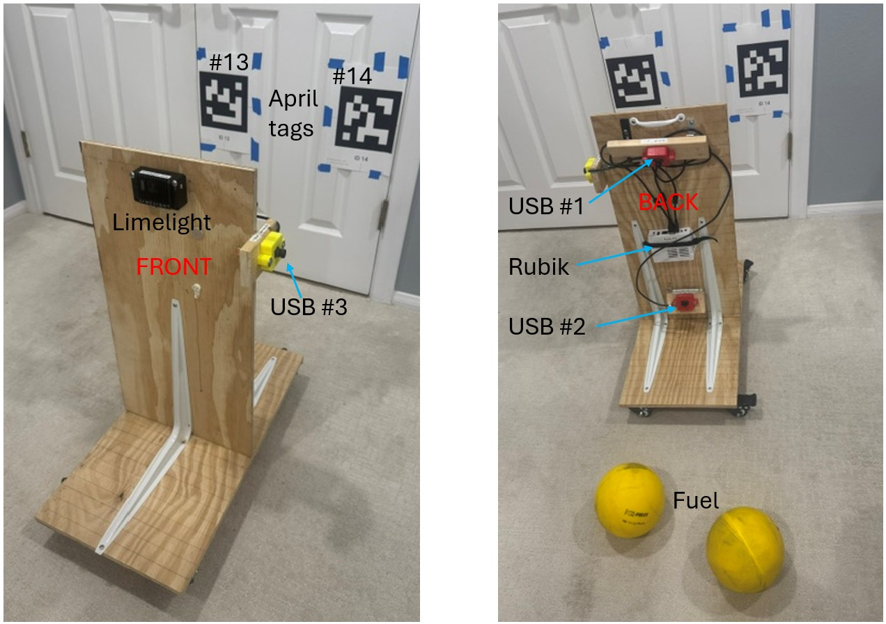
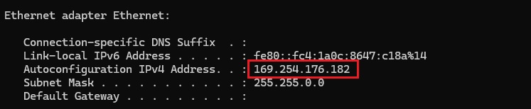
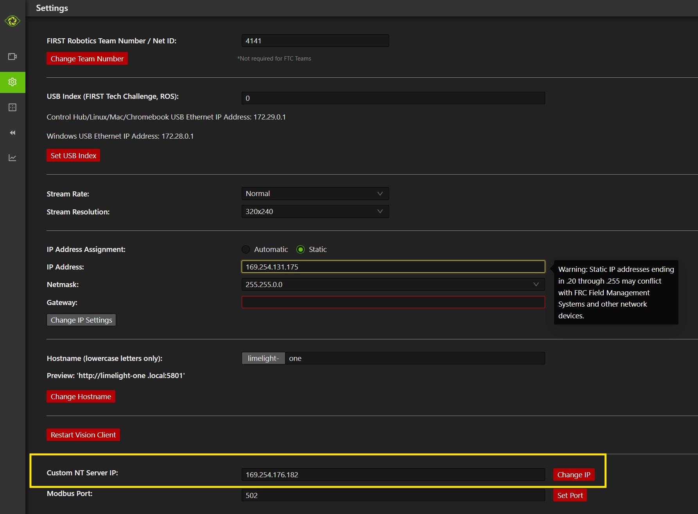
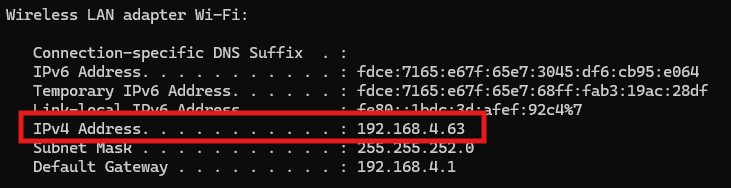
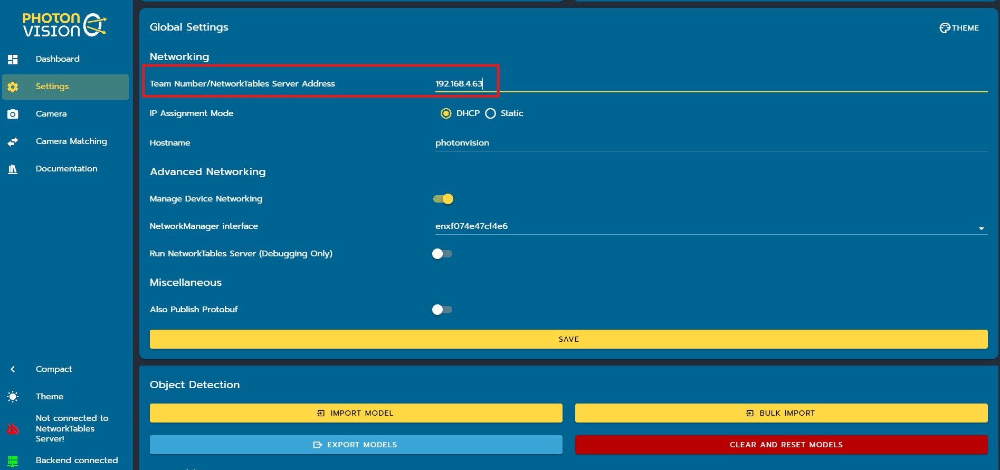

# Setting Up Vision Hardware-in-the-Loop

This section describes the test board on which the vision devices are installed as well as the software settings required to simulate with AdvantageScope and hardware in the loop.

## Test Board and Targets
The test board consists of several vision devices (Limelight and Rubik cameras) installed on a wooden test board which is mounted vertically on a wheeled platform. In a sense, this unit serves as a robot mockup with vision sensors positioned as if on a real robot but without any drive train or other mechanisms. In addition, apriltags and game pieces are needed as targets for the vision sensors.

Below are a couple of pictures of such a test board. 

This unit consists of four vision sensors:

- A Limelight 4 (front, pointing horizontal)
- USB camera #1 (back, pointing down)
- USB camera #2 (back, pointing up)
- USB camera #3 (left, pointing horizontal)

USB camera #1 is for detecting objects on the floor; the other three sensors are for detecting apriltags.

The three USB cameras are attached to the Rubik Pi 3 on the back.

Two apriltags (13 and 14) are positioned on the wall at the same height and relative positions as on the 2026 playing field where they appear under the outpost.

Yellow balls ("fuel" 2026 game pieces) are used for object detection.

## MonarchVision Settings
Turn on simulation mode in `Constants.java`:
```java
  public static final Mode simMode = Mode.SIM;
```

## Limelight Settings
1. Plug a dedicated USB power-only cable into the top of the Limelight. (Do not use power from a USB port on your laptop.)
2. Connect an RJ45 enternet cable from your laptop to the bottom of the Limelight.
3. Find the Ethernet address of your laptop by running `ipconfig` in a Powershell. (Do not use the wireless ip address.) 
4. Enter that address (`169.254.176.182`) as the custom Network Tables server address at the bottom of the Settings tab of the Limelight web client. This ensures that Limelight sends its results to the NetworkTable server so they can be read by the robot program and displayed in AdvantageScope. 
5. If necessary, turn off your firewall.

>Important: make sure that "Full 3D Targeting" is turned on in the Advanced tab of the Limelight web interface.

## PhotonVision Settings

1. Plug a dedicated USB power-only cable into the top of the Rubik. (Do not use power from a USB port on your laptop.)
2. Find the WIFI address of your laptop by running `ipconfig` in a Powershell. (Do not use Ethernet ip address.) 
3. Enter that address (`192.168.4.63`) as the `Team Number/NetworkTables Server Address` in the Settings tab of the PhotonVision dashboard. This ensures that PhotonVision sends its results to the NetworkTable server so they can be read by the robot program and displayed in AdvantageScope. Click the `Save` button after entering the address. 
