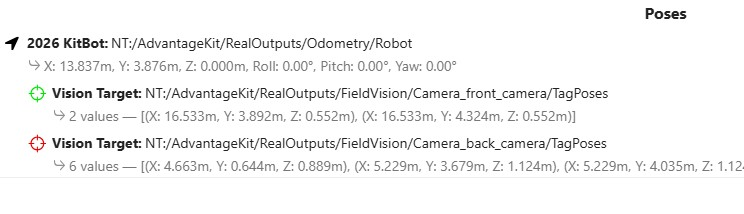
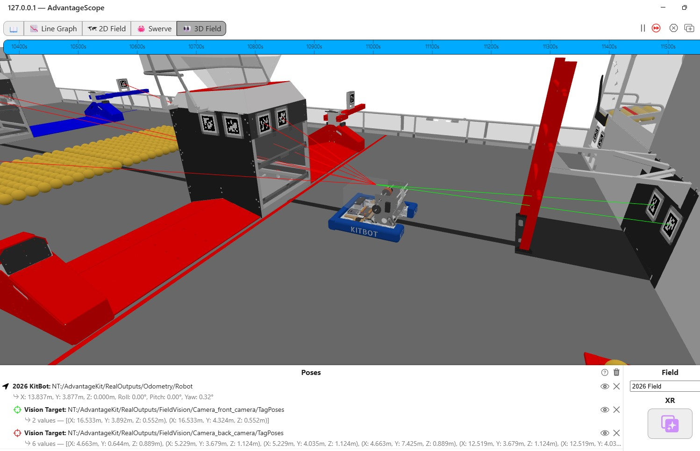
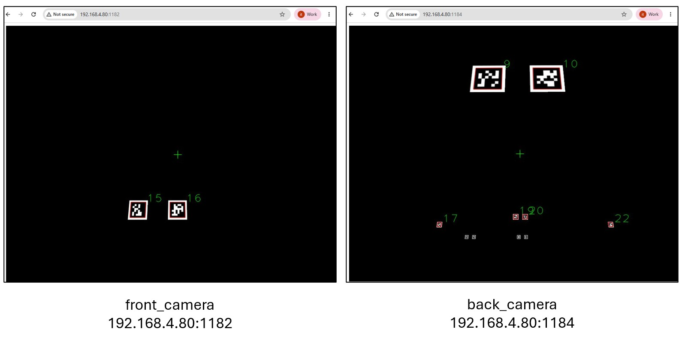
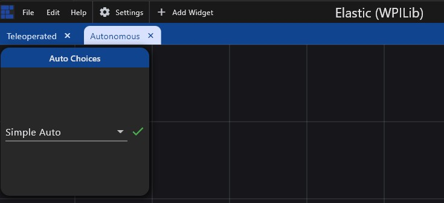

# Pure Simulation: Field Vision

This section describes how to use AdvantageScope to simulate an entire robot, including virtual vision devices which detect apriltags in the virtual environment of the playing field. This enables the robot's position and orientation on the field to be estimated accurately and displayed in AvantageScope.
>Make sure that all of the [setup](sim-setup.md) has been completed first.

## Start-up

1. Start the simulation session. [Click here for detailed instructions on startup.](../simulation-framework/advantagescope.md#simulation-startup)
2. In AdvantageScope, use the `2D Field` and/or `3D Field` tab to view the location of the robot and lines of sight to april tags on the field. [Click here for instructions on how visualize the poses of the robot and apriltag vision targets.](../simulation-framework/advantagescope.md#simulating-field-location)
3. Make sure that the displayed poses in AdvantageScope correspond to the `robotCameras` defined in the [Field Vision settings](sim-setup.md#settings-for-field-vision). See below for the poses that correspond to the Limelight cameras defined on the front (green) and back (red) of the robot.  

## Simulating Teleop
In the Robot Simulation GUI, select `Teleoperated` and use the controller to drive the robot around the virtual playing field. As you do,the red and green lines of sight will indicate which apriltags are being detected. See below for an example. 

 You can also get a simulated view from each camera by typing the address `<wireless ip address>:<port#>` into a browser window. The `port#` is 1182 for first camera, 1184 for the second, etc. The example below shows the simulated camera views for the front and back cameras. Note that these are perspective views so apriltags in the distance are small and would in practice not actually be detected by real hardware. 

## Simulating Autonomous
Since odometry accuracy is particularly important during the autonomous period, it's a good practice to simulate auto commands in AdvantageScope to ensure that apriltags are visible throughout the robot's movements:

1. Start the Elastic tool and select an Auto command to run. 
2. In the Robot Simulation GUI, select `Autonomous` to initiate the auto command. When the `Simple Auto` executes, you will notice that the apriltags are in view throughout.

## Troubleshooting
Double check your [setup](sim-setup.md). The most likely issues are:

- `hardwareInTheLoop` is set to true in `FieldVisionConstants.java`
- AdvantageScope is not connected to the NetworkTables simulator
