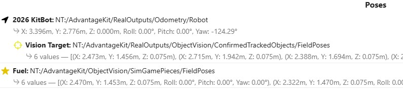
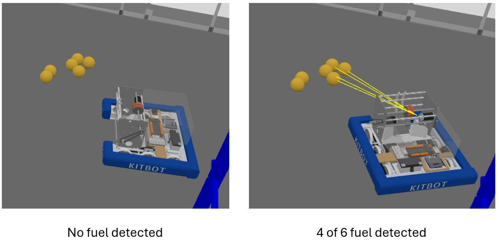

# Pure Simulation: Object Detection

This section describes how to use AdvantageScope to simulate detection of objects (game pieces) on the virtual field.
>Make sure that all of the [setup](sim-setup.md) has been completed first.

## Start-up

1. Start the simulation session. [Click here for detailed instructions on startup.](../simulation-framework/advantagescope.md#simulation-startup)
2. In AdvantageScope, use the `2D Field` and/or `3D Field` tab to view the location of the robot and lines of sight to objects detected on the field. [Click here for instructions on how visualize the poses of the robot and object vision targets.](../simulation-framework/advantagescope.md#simulating-object-detection)
3. Add `RealOutputs/ObjectVision/ConfirmedTrackedObjects/FieldPoses` to the AdvantageScope poses so that lines of sight are displayed from the camera to detected objects.
4. Add `ObjectVision/SimGamePieces/FieldPoses` to the AdvantageScope poses so that the **detectable** game pieces are displayed on the virtual field. See [game piece definition](sim-setup.md#virtual-game-pieces) for how to define where these game pieces should be displayed.

See below for the complete set of poses for:

- Robot
- Lines of sight from camera on the front of the robot to detected objects
- Detectable objects

## Simulating
As the robot moves around the virtual field, whether in Teleop or Autonomous mode, game pieces will be detected if they are in the field of view of the object camera. In the picture below on the left, the robot is near detectable fuel objects but the camera is not pointing toward them so nothing is detected. The picture on the right shows that fuel is detected once the robot rotates so that the camera is facing some of the objects. 

## Drive to Object
The main reason for detecting game pieces on the field is to optimize how the robot interacts with them. As an example, a command could determine a drive path to intake the maximize amount of detected fuel in the vicinity of the robot. MonarchVision has a simple command called `DriveRobotFeatureToTarget` to accomplish such a task. The command does the following:

- Categorizes detected fuel into clusters
- Prioritizes the clusters
- Computes a drive path such that a feature on the robot (such as an intake) passes through the center of the cluster

## Troubleshooting
Double check your [setup](sim-setup.md). The most likely issues are:

- `hardwareInTheLoop` is set to true in `ObjectVisionConstants.java`
- AdvantageScope is not connected to the NetworkTables simulator
