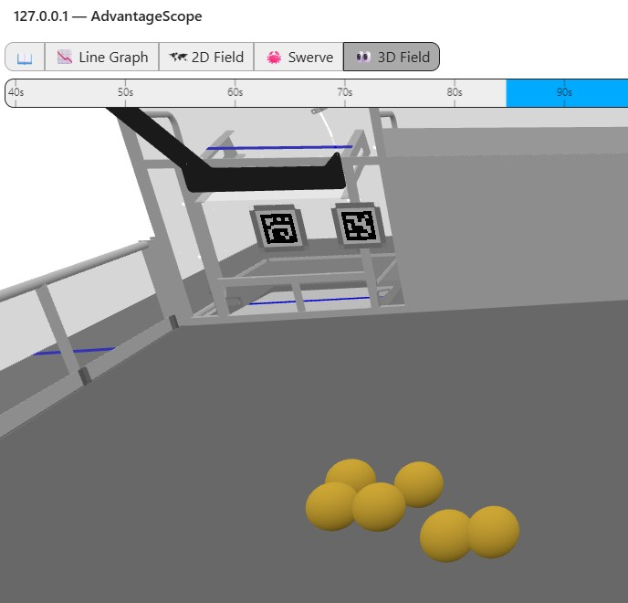

# Setting Up Pure Simulation

This section describes the software settings required to simulate the entire robot (including vision devices) with AdvantageScope.

## MonarchVision Settings
Turn on simulation mode in `Constants.java`:
```java
  public static final Mode simMode = Mode.SIM;
```

## Settings for Field Vision
If you are using vision devices to detect apriltags for determining the placement of the robot on the virtual field, edit the Java code as follows:

1. Turn off hardware-in-the-loop mode for apriltag detection in `FieldVisionConstants.java`:
```java
  /** Are we running a physics simulator, but with a real camera connected. */
  public static boolean hardwareInTheLoop = false;
```

2. If necessary, change  `robotCameras` in `FieldVisionConstants.java` which defines the camera(s) on the robot to be used for detecting apriltags. Each `CameraSpec`  specifies the type of camera, its name, and its position and orientation relative to the center of the robot. In the example below, there are two Limelight cameras, one of the front and one on the back, both pointing up.
```java
  // The following is a definition of all cameras on the real robot. These are also used
  // by simulation
  public static CameraSpec[] robotCameras = {
    new CameraSpec(
        VisionType.LIMELIGHT,
        "front_camera",
        new Transform3d(
            Constants.robotLengthInMeters / 2.0, 0.0, 0.2, new Rotation3d(0.0, -0.4, 0.0))),
    new CameraSpec(
        VisionType.LIMELIGHT,
        "back_camera",
        new Transform3d(
            -Constants.robotLengthInMeters / 2.0, 0.0, 0.2, new Rotation3d(0.0, -0.4, Math.PI)))
  };
```

## Settings for Object Detection
If you are using vision devices to detect objects, edit the Java code as follows:

1. Turn off hardware-in-the-loop for object detection in `ObjectVisionConstants.java`:
```java
  /** Are we running a physics simulator, but with a real camera connected. */
  public static boolean hardwareInTheLoop = false;
```

2. If necessary, change  `robotCameras` in `ObjectVisionConstants.java` which defines the camera(s) on the robot to be used for detecting objects. Each `CameraSpec`  specifies the type of camera, its name, and its position and orientation relative to the center of the robot. In the example below, there is a single Rubik / PhotonVision camera on the back of the robot, pointing down.

```java
  // The following is a definition of all cameras on a test harness used to test
  // vision hardware-in-the-loop object detection
  public static CameraSpec[] hardwareInLoopCameras = {
    new CameraSpec(
        VisionType.PHOTONVISION,
        "rubik_camera1",
        new Transform3d(
            -Constants.robotLengthInMeters / 2.0, // On back of robot
            0.0,
            Units.inchesToMeters(20.5),
            new Rotation3d(
                0.0,
                Math.toRadians(35.), // Positive points down!!! See above.
                Math.PI))) // Facing backwards
  };
```
### Virtual Game Pieces

You can define the locations of virtual game pieces by editing the file `fuel_layout.json` which should be in the `deploy/objectvision` directory. Below is an example which which shows six fuel game pieces displayed on the virtual field, along the its associated `.json` file. 
```java
{
  "gamePiecesArray": [
    {
      "className": "Fuel",
      "fieldPositions": [
        {
          "x": 2.540,
          "y": 1.453,
          "z": 0.075
        },
        {
          "x": 2.322,
          "y": 1.560,
          "z": 0.075
        },
        {
          "x": 2.431,
          "y": 1.781,
          "z": 0.075
        },
        {
          "x": 2.761,
          "y": 1.894,
          "z": 0.075
        },
        {
          "x": 2.655,
          "y": 1.671,
          "z": 0.075
        },
        {
          "x": 2.871,
          "y": 2.009,
          "z": 0.075
        }
      ]
    }
  ]
}
```
