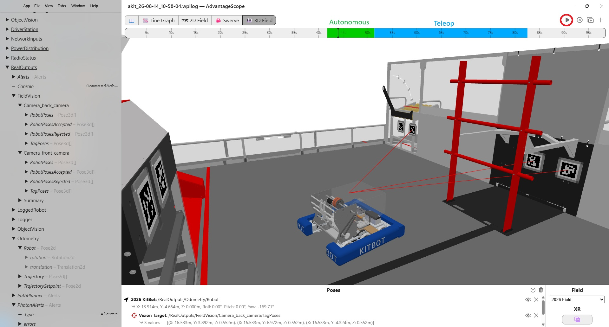
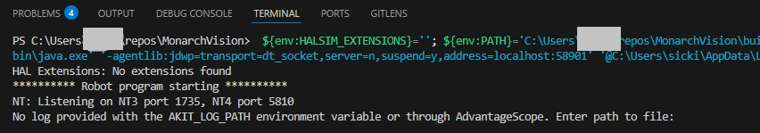
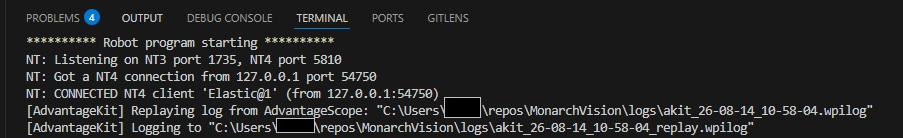
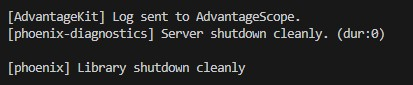
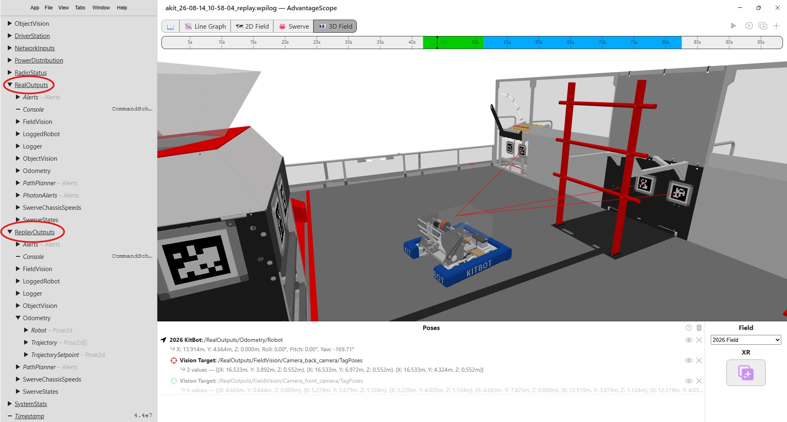

# Log Files

## Overview
Using the design philosophy of the AdvantageKit templates, MonarchVision employs comprehensive logging of all input and output data for all subsystems. The resulting log file can be opened in AdvantageScope to inspect what occurred during a previous session, whether that session was a virtual simulation or a real session driving a physical robot. In addition, the log file can be replayed using the current code base to determine if software changes have corrected a problem detected in the original session.

Log files are especially important for debugging and correcting problems encountered during a practice or competition match.

The main topics in this section are:

- Where to find log files
- How to use AdvantageScope to inspect the log file from a previously recorded session
- How to replay the inputs captured in a log file
- How to use AdvantageScope to inspect the log file generated by Replay

See the [AdvantageKit Replay documentation](https://docs.advantagekit.org/getting-started/traditional-replay) for more information.


## Recording a Log File
Log files are saved automatically during every session, whether it is a simulation session or a real robot. Log files are typically named using the current date and time, like this:
```
akit_26-08-12_08-00-56.wpilog
```
When running a simulation session, log files are stored in the `logs` folder under your project directory. When running a real robot session, log files are normally saved to a USB flash drive connected to the roboRIO and stored in the path `/u/logs/`.

## Inspecting a Log File
A log file can be opened in AdvatageScope to inspect input and output data as well as visualize the position of the robot on the field. The following screenshot shows the result of opening the log file `akit_26-08-14_10-58-04.wpilog` in AdvantageScope. The timeline at the top indicates that we are at the beginning of the autonomous period (green portion). You can drag the time point back and forth through the autonomous and teleop periods (blue) or press the play button to animate the entire session. At any point in time the graphics in the 2d or 3d field view are updated as are all the data on the left.
>Note that output data from a normal session (simulation or real robot) are stored under the `RealOutputs` key.



## Replaying a Log File
MonarchVision can be run in one of three modes: real robot, simulation, or replay. See `Constants.java`:

```java
  public static enum Mode {
    /** Running on a real robot. */
    REAL,

    /** Running a physics simulator. */
    SIM,

    /** Replaying from a log file. */
    REPLAY
  }
```
In replay mode, MonarchVision, running in VSCode, reads input data from an existing log file (for example, `akit_26-08-12_08-00-56.wpilog`) and recomputes all output data using the current version of the code, which might be different from when the original log file was generated. Since the replay is executing in VSCode, you can set breakpoints to check the internal state of the code at any point in time. The replay session generates a second log file (for example, `akit_26-08-14_10-58-04_replay.wpilog`) which can then be inspected with AdvantageScope in the same way as the original log file.

Replay uses the following priorities to determine the log file to be replayed:

1. The value of the `AKIT_LOG_PATH` environment variable, if set
2. The file currently open in AdvantageScope, if any
3. The result of a prompt displayed in VSCode when MonarchVision is run in Replay mode.

>It is generally preferred to open the input log file in AdvantageScope before proceeding.

To replay the log file determined by these priorities, do the following in VSCode:

1. Open the MonarchVision project.
2. Make sure that the current mode is set to replay in `Constants.java`:
    ```
    public static final Mode currentMode = Mode.REPLAY;
    ```
3. Select `Simulate Robot Code` from the WPILib Command Palette.
4. When the following menu pops up, **do not** select "Sim GUI". Just click Ok. 
5. If the input log file cannot be determined (that is, the `AKIT_LOG_PATH` environment variable is not set and no log file is active in AdvantageScope), VSCode will prompt for where to find the input log file: 
6. (Optional) Set breakpoints.
7. Replay begins by displaying the names of the input and output log files: 
8. MonarchVision execution continues based on the input values in the log file - and then terminates:

    .

    > Note that if AdvantageScope is already running, it will automatically open the log file generated by Replay (`akit_26-08-14_10-58-04_replay.wpilog`).

## Inspecting a Replay Log File
If the replay log file was not automatically opened in AdvantageScope, you can open it manually. Below is a screenshot of the replay log file in AdvantageScope. It can be inspected as normal with one exception; there are two sets of output data:

- Data under RealOutputs are the output values recorded during the original session
- Data under ReplayOutputs are the output values recorded during the Replay session

>Note that the input values are identical in both the original and the replay sessions.


