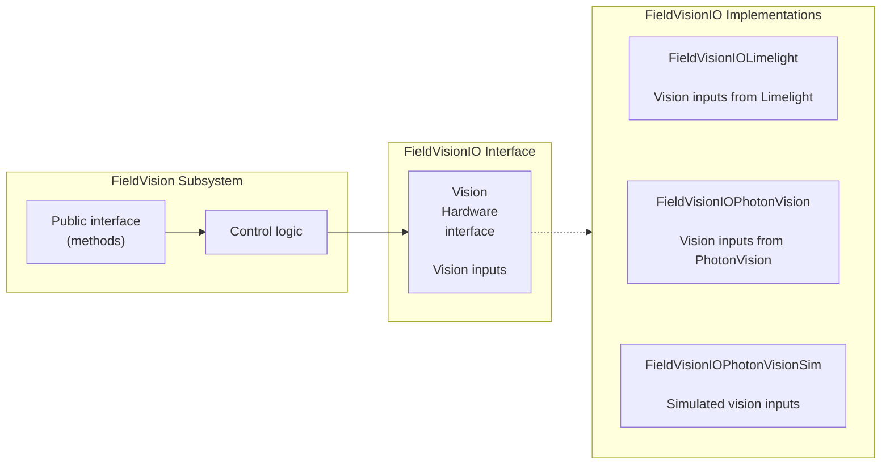
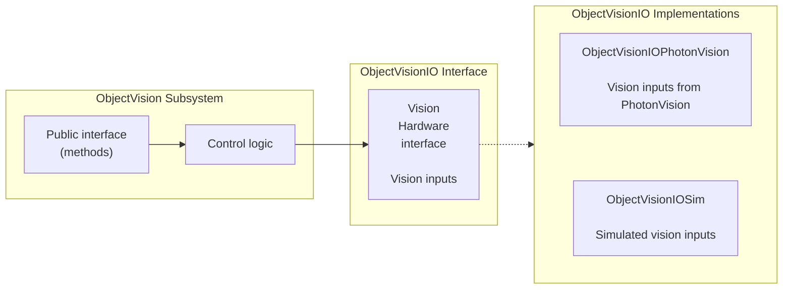
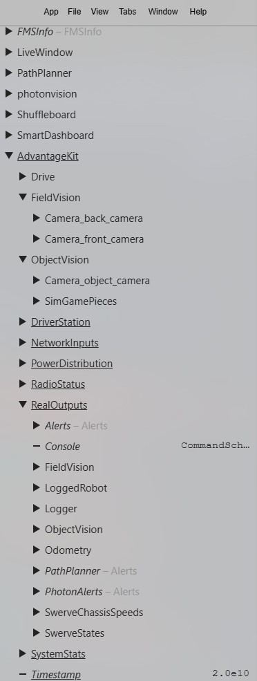

# AdvantageKit

## Overview
MonarchVision logs all input and output data for all subsystems using the [AdvantageKit](https://docs.advantagekit.org/) framework. This enables efficient debugging during a simulation session as well as the ability to easily replay the log file from a previous session (whether it was a simulation session or one for a real robot). In addition, MonarchVision's architectitecture is aligned with that of the AdvantageKit [template projects](https://docs.advantagekit.org/getting-started/template-projects) to enable subsystems (especially drive and vision) to be developed and debugged in a hardware-independent manner, as well as simulated.

This section describes the software architecture and how to log data. The [next section](advantagekit-log-files.md) explains how to record, inspect, and replay log files.

## Installation
See the [AdvantageKit Installation documentation](https://docs.advantagekit.org/getting-started/installation/) for information on how to install its vendordep and related topics.

## Software Architecture
See the [Data Flow](https://docs.advantagekit.org/category/data-flow) section of the AdvantageKit documentation for details of how architect an WPILib application to support logging, simulation, and hardware independence. The following is a short description of how the AdvantageKit design pattern is applied in MonarchVision.

Subsystems are designed to separate control logic from the underlying hardware. This is accomplished by defining a hardware interface which consists of methods required by the subsystem to perform its functionality. That hardware interface can be implemented for various types of hardware so that the subsystem can operate in any hardware configuration - or with purely simulated hardware. In the case of MonarchVision, this is approach is used for the vision-related subsystems FieldVision and ObjectVision.

### FieldVision

The FieldVision subsystem is for detecting apriltags and updating the robot odometry. The hardware-independent interface is FieldVisionIO and it has implementations for Limelight (FieldVisionIOLimelight), Rubik Pi3 PhotonVision (FieldVisionPhotonVision), and pure simulation (FieldVisionPhotonVisionSim).



### ObjectVision

The ObjectVision subsystem is for detecting game pieces (such as fuel). The hardware-independent interface is ObjectVisionIO and it has implementations for Rubik Pi3 PhotonVision (ObjectVisionPhotonVision) and pure simulation (ObjectVisionSim). Note that there currently is no implementation for object detection with Limelight.



### Instantiation

At startup, the RobotContainer class instantiates the FieldVision and ObjectVision objects by passing in an array of IO implementations depending on the operating environment (simulated or real vision hardware).

## Logging
The AdvantageKit framework makes it easy to log all input and output data which is crucial for debugging and replay of log files. The logged data can be viewed in NetworkTables under the `AdvantageKit` key. Output data is under the `RealOutput` key or `ReplayOutput` key depending on whether or not this is a replay session.



### Logging Input
See the [Recording Inputs](https://docs.advantagekit.org/data-flow/recording-inputs) section of the AdvantageKit documentation for details of how to log input data for a subsystem.

As described above, each subsytem (for example, `FieldVision`) has a corresponding IO interface (for example, `FieldVisionIO`) to abstract the hardware-dependent code. The IO interface contains a class (for example, `VisionIOInputs`) that defines all of the data.
```java
public interface FieldVisionIO {
  @AutoLog
  public static class VisionIOInputs {
    public boolean connected = false;
    public TargetObservation latestTargetObservation =
        new TargetObservation(Rotation2d.kZero, Rotation2d.kZero);
    public PoseObservation[] poseObservations = new PoseObservation[0];
    public int[] tagIds = new int[0];
  }

  public default void updateInputs(VisionIOInputs inputs) {}
}
```
The `@AutoLog` annotation will automatically generate a class (for example, VisionIOInputsAutoLogged) with methods to save the input data to a log file (`toLog`) and replay the data from a log (`fromLog`).

>Note that these classes are generated automatically during a gradle build and placed in the folder: build / classes / generated sources / annotationProcessor. You might have to invoke the build using Build Robot Code. If all else fails, bring up the command palette in VS Code (ctrl+Shift+P) and Run "Java: Clean Java Language Server Workspace". Then click "Reload and Delete".

The subsystem (`FieldVision`) contains instances of the IO implementations (`FieldVisionIO`) and the inputs (`VisionIOInputsLogged`). The periodic method updates the inputs and then saves them to the log file with `Logger.processInputs()`.

```java
public class FieldVision extends SubsystemBase {
  private final FieldVisionIO[] io;
  private final VisionIOInputsAutoLogged[] inputs;

  @Override
  public void periodic() {
    for (int i = 0; i < io.length; i++) {
      io[i].updateInputs(inputs[i]);
      Logger.processInputs("FieldVision/Camera_" + io[i].getName(), inputs[i]);
    }
```

### Logging Output
See the [Recording Outputs](https://docs.advantagekit.org/data-flow/recording-outputs/) section of the AdvantageKit documentation for details of how to log output data for a subsystem.

Output data can be explicitly recorded using the `Logger.recordOutput()` method. This data will be placed under RealOutput or ReplayOutput depending on whether or not this is a replay session. Here is an excerpt from the `periodic()` method of `FieldVision`.

```java
    // Log summary data
    Logger.recordOutput("FieldVision/Summary/TagPoses", allTagPoses.toArray(new Pose3d[0]));
    Logger.recordOutput("FieldVision/Summary/RobotPoses", allRobotPoses.toArray(new Pose3d[0]));
```

Or any methods prefaced with `AutoLogOutput` annotation will result in the returned value to be logged as output data under the given key.

```java
  /** Returns the current odometry pose. */
  @AutoLogOutput(key = "Odometry/Robot")
  public Pose2d getPose() {
    return poseEstimator.getEstimatedPosition();
  }
```
