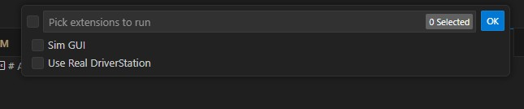
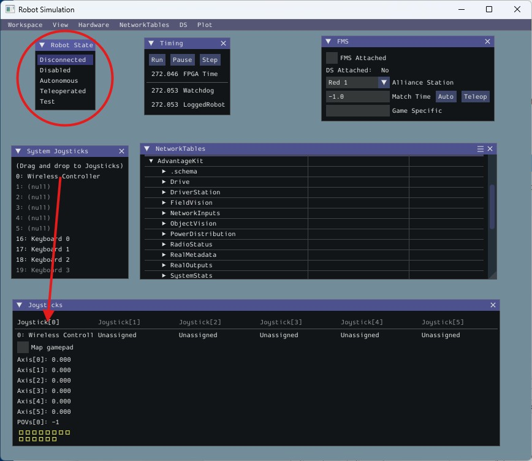
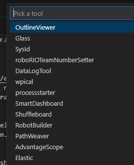
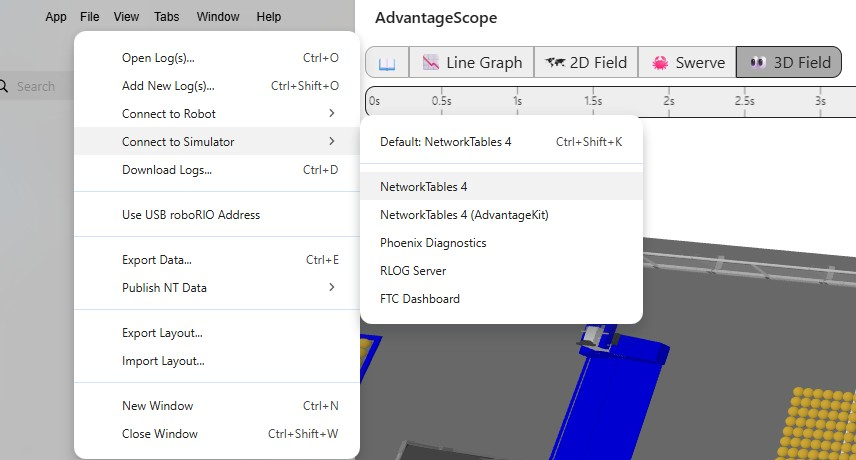
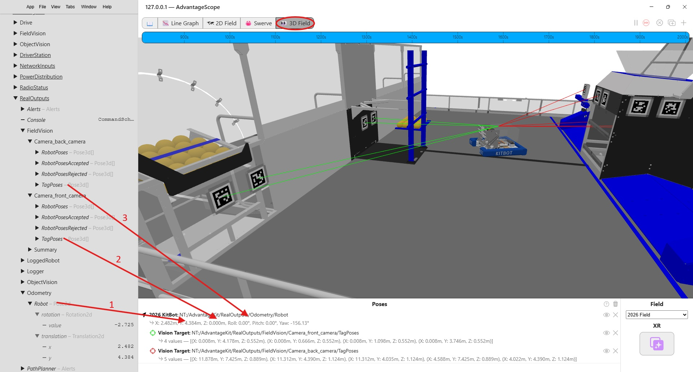
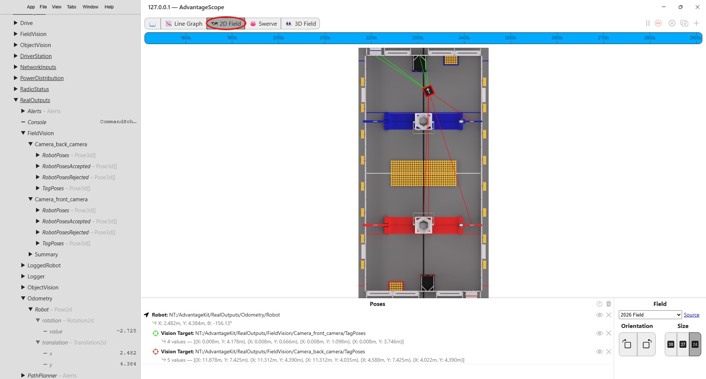
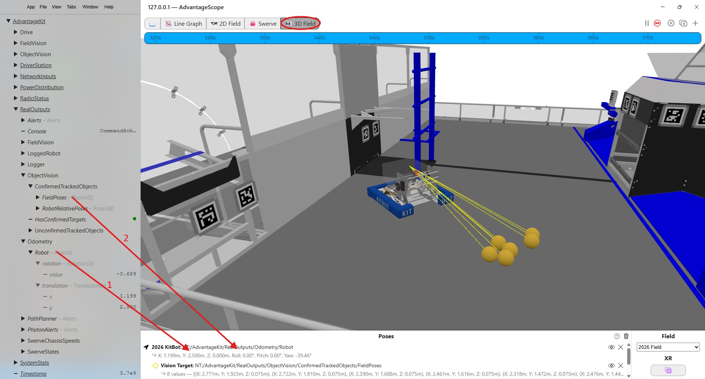
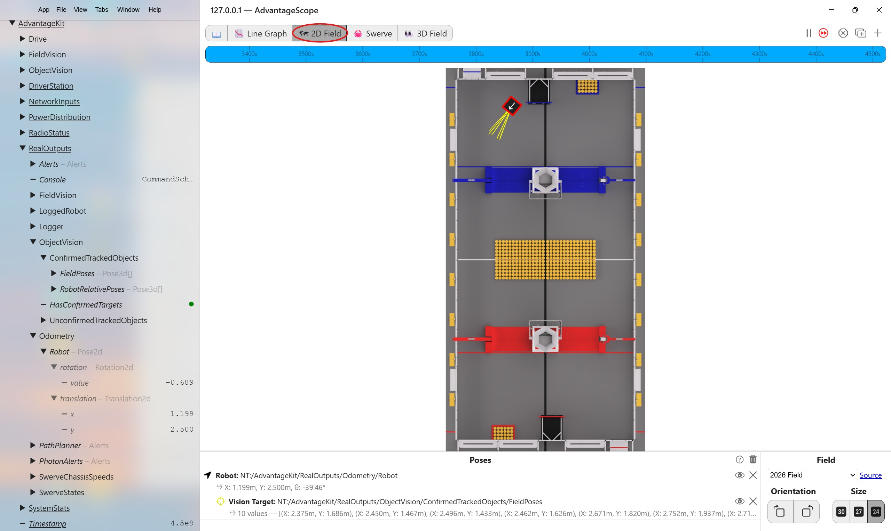

# AdvantageScope

## Overview
[AdvantageScope](https://docs.wpilib.org/en/stable/docs/software/dashboards/advantagescope.html) is a graphical tool for simulating and debugging FRC applications. It can be connected live to a running application so that it responds to updates via NetworkTables. Or, it can replay a log file generated from a previous session. This is particularly useful for debugging a scenario from a prior competition or practice match. AdvantageScope can graphically represent the robot as it moves around the field and highlight vision behavior, such as detecting april tags and game pieces.

This section describes only the vision-related capabilities of AdvantageScope. See the [WPILib AdvantageScope documentation](https://docs.wpilib.org/en/stable/docs/software/dashboards/advantagescope.html) for more information.

## Installation
AdvantageScope is one of the standard dashboards contained in the WPILib installation. It needs no special installation.

## Simulation Startup
To start a simulation session using Visual Studio Code and AdvantageScope, do the following.

1. In Visual Studio Code, open the MonarchVision project and select "Simulate Robot Code" from the WPILib Command Palette.
2. When the following menu pops up, click "Sim GUI" and then Ok. 
3. The following Robot Simulation window will then be displayed. You can use it to change the state of the robot from Disabled to Teleoperated and/or Autonomous. If you have a Playstation or Xbox controller connected to your computer it will be displayed in System Joysticks. Drag and drop the controller on to Joystick[0] 
4. In Visual Studio Code, select "Start Tool" from the WPILib Command Palette.
5. When the following menu pops up, click AdvantageScope. 
6. When AdvantageScope appears, connect it to the simulation session running in VisualStudio by selecting File -> Connect to Simulator -> Network Tables 4.  The VisualStudio app will then be a NetworkTables server for AdvantageScope. 

## Simulating Field Location
The following AdvantageScope screenshot shows a 3D view of the robot on the competition field, with green and red lines of sight from the front and back mounted cameras to detected april tags. The panel on the left contains all of the input and output fields being logged by the simulation session. 

To set up this view, select the 3D Field in the tab at the top and then:

1. Drag the Odometry/Robot field from the panel on the left on to the Poses panel on the bottom.
2. Drag the FieldVision/Camera_front_camera/TagPoses field from the panel on the left **on top of** the Odometry/Robot in the Poses panel.
3. Drag the FieldVision/Camera_back_camera/TagPoses field from the panel on the left **on top of** the Odometry/Robot in the Poses panel.

The display attributes (color, shape, etc.) of the robot and vision lines can be customized by right clicking on the pose.

Similarly, robot and april tag detection can be simulated in a 2D view. 

## Simulating Object Detection
The following AdvantageScope screenshot shows a 3D view of the robot on the competition field, with yellow lines of sight from a camera to detected objects (yellow balls called fuel from the 2026 FRC competition). 

To set up this view, select the 3D Field in the tab at the top and then:

1. Drag the Odometry/Robot field from the panel on the left on to the Poses panel on the bottom.
2. Drag the ObjectVision/ConfirmedTrackedObjects/FieldPoses field from the panel on the left **on top of** the Odometry/Robot in the Poses panel. If this field is not displayed as lines, right click on it in the Poses panel and select Vision Target rather than Component.

Similarly, object detection can be simulated in a 2D view. 
