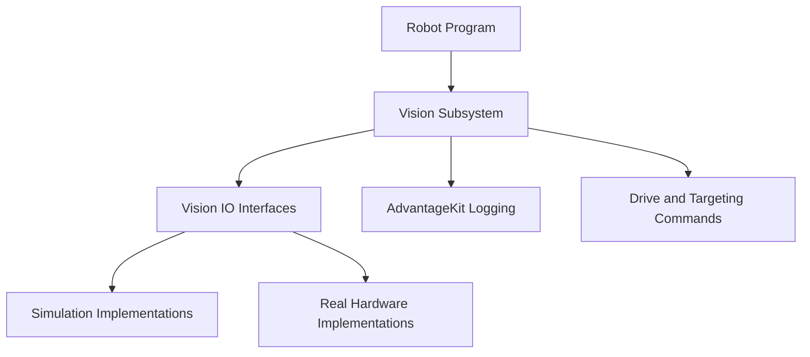

# Software Architecture

## Objective

Explain how simulation, real hardware, logging, and robot commands share a common architecture.

## Suggested architecture diagram

## Topics to cover

- Subsystem organization
- IO interfaces
- Real, simulated, and replay implementations
- AdvantageKit-generated input classes
- Camera-specific adapters
- Shared observation records
- Field vision versus object vision
- Target-selection services
- Drive commands
- Logging boundaries
- Configuration constants
- Data flow and update timing

## Design goals

- Run the same high-level code in simulation and on the robot
- Keep hardware-specific APIs out of commands
- Make observations easy to log and replay
- Support multiple cameras
- Reject invalid or stale observations consistently
