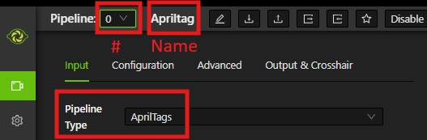
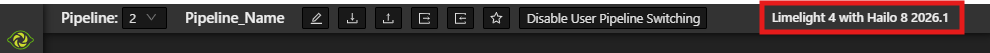
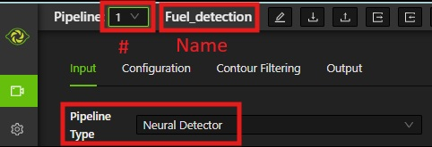
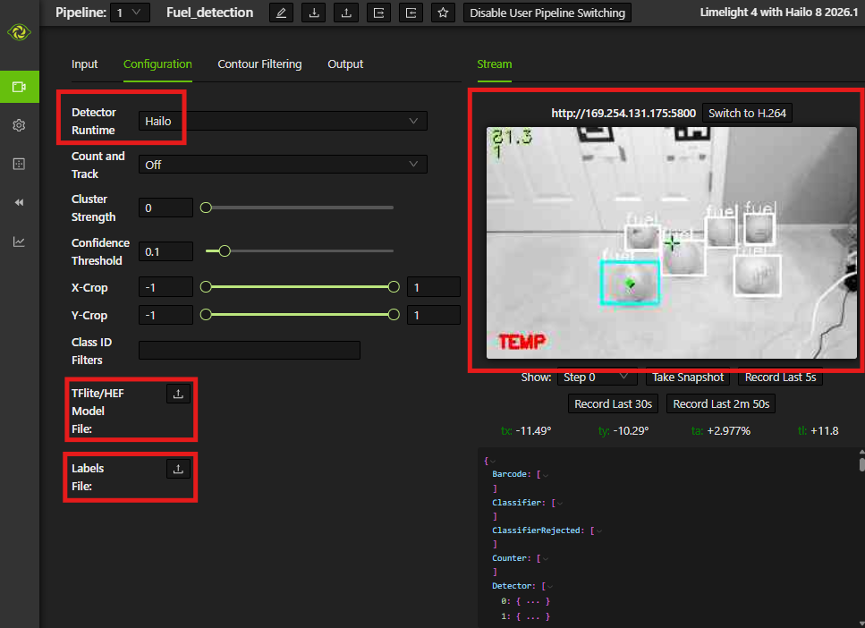

# Limelight

## Overview
This secion documents how to install, set up, and use the [Limelight](https://limelightvision.io/) smart camera with built-in coprocessor. It specifically discusses the Limelight 4 but is largely applicable to other models.

See the [Limelight 4 documentation](https://docs.limelightvision.io/docs/docs-limelight/getting-started/limelight-4) for detailed information about mounting, setup, and usage.

## Hardware Setup

### Installing on a Real Robot
To connect the Limelight to a real robot:

- **Power** - Hardwire the Limelight to the PDP, PDH, or Mini PDP, using a 5A or 10A breaker
- **Data** - Connect an ethernet cable from the radio on the robot to the Limelight

### Installing for Bench Testing
To connect the Limelight to a laptop for bench testing:

- **Power** - For general setup and apriltag detection, power can be supplied to the Limelight by a dedicated USB-C power cable. (Power from a USB port on the laptop may be insufficient.) However, for object detection, power must be supplied by a 12V DC, 3A regulated power adapter. You can attach a female barrel-to-screw-terminal adapter to the end of the power cable and then connect red/black wires from the barrel connector to the Limelight.
- **Data** - Connect an ethernet cable from the laptop to the Limelight

## Update Firmware and Drivers

Install the [Limelight Hardware Manager](https://docs.limelightvision.io/docs/resources/downloads)

Start the Hardware Manager and click `Find Devices on Local Network` 

After the ip addresses are listed, click on the ethernet address (in this case, 169.254.131.175) 

This will display the Limelight web interface in a browser window 

The firmware version number is shown in the upper right corner of the dashboard. In this case, it is version 2026.1. Check the [Limelight downloads page](https://docs.limelightvision.io/docs/resources/downloads) to see if there is a more recent version. If so, download it and do the following:

- Power off your Limelight
- Download the latest Limelight Hardware Manager and Limelight OS image
- Hold the config button while connecting a USB-C cable from your laptop to your Limelight. The config button is a small hole next to the lens on the front of the Limelight. Insert a paperclip or small tool inside the hole to press it.
- Open Limelight Hardware Manager
- Navigate to the `Flash OS` tab
- Select the OS image file and wait for extraction to complete
- Select target device. You might have to click `Refresh Device List` to see your device
- Select your Limelight device from the list
- Click `Flash Device` and wait for completion 
- Click `Install/Reinstall Drivers` in upper right
- Remove the USB cable after completion

## Limelight Settings
Start the Limelight web interface:

From the Hardware Manager  click `Find Devices on Local Network` 
After the ip addresses are listed, click on the ethernet address (in this case, 169.254.131.175) 
This will display the Limelight web interface in a browser window.

Go to the Settings tab to change the team number and Hostname 

### Pipeline - Apriltags
To set up a pipeline to detect apriltags, do the following.

1. Go to the `Pipelines` tab on the left to configure pipelines.
2. Asign a pipeline number, give it a name, and specify type of `AprilTags`.
3. Click the Advanced tab at the top to set the `Full 3D Targeting` to `Yes` and to define the location and orientation of the Limelight camera relative to the center of the robot. These settings are `LL Forward`, `LL Right`, etc. Afterwards, apriltags will be detected and shown in the graphics window on the right. 

4. Click the `Input` tag at the top to configure the pipeline (exposure, etc.). On that tab, click `Switch to MJPEG`:  

This will give you a camera view along with detected april tags: 

### Pipeline - Object Detection
To set up a pipeline to detect objects such as game pieces (fuel for the 2026 competition), do the following.

1. Go to the `Pipelines` tab on the left to configure pipelines.
2. Make sure that the Hailo accelerator is installed on your Limelight. You can verify this in the upper right banner of the web interface.   
3. Asign a pipeline number, give it a name, and specify type of `Neural Detector`.
4. Download from the [Limelight Downloads page](https://docs.limelightvision.io/docs/resources/downloads) the neural network model and labels for the type of objects you want to detect. For fuel game pieces from the 2026 competition, download `Fuel B1 Model` (.hef file) and the `Fuel Labels` (.txt file).
5. On the `Configuration` tab upload the HEF and label files.
6. Switch the `Detector Runtime` from `CPU` to `Hailo`. (Otherwise, it will detect common objects like chars rather than fuels.)
7. click `Switch to MJPEG` to see the results of object detection: 
8. To improve detection results, you can adjust the camera and pipeline settings (`Confidence Threshold`, `Exposures`, `Sensor Gain`, `Distance/size`, `Lighting/background`). Also, results tend to be better when the objects are more the 2-3 feet from the Limelight.