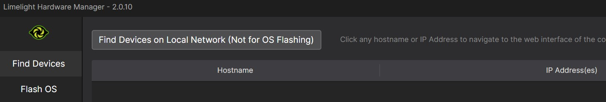
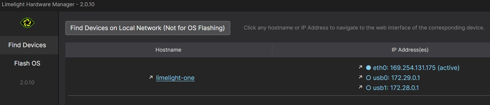
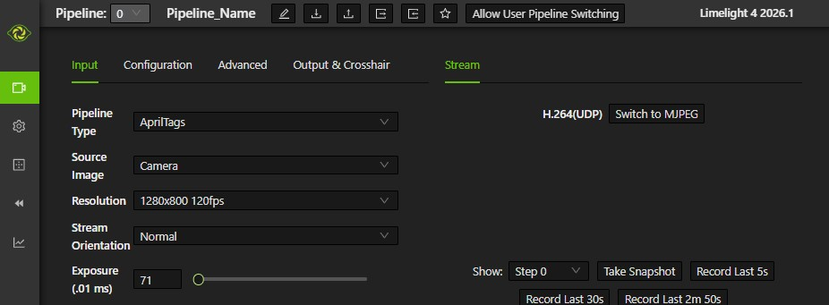
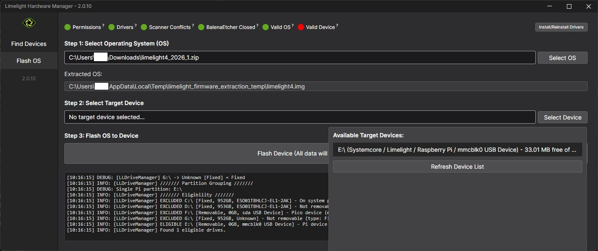
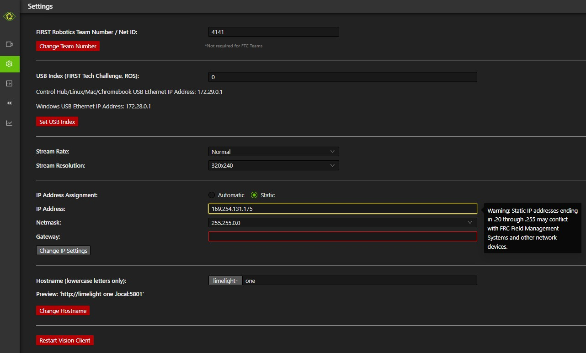
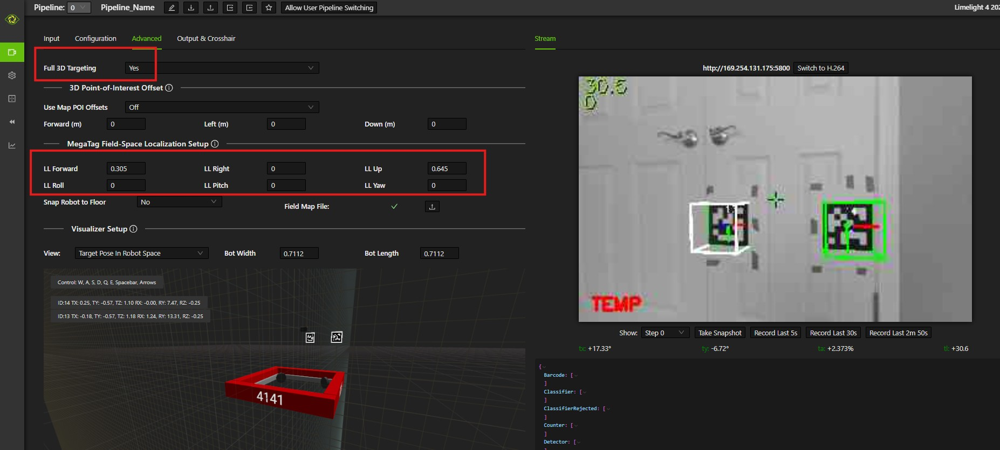
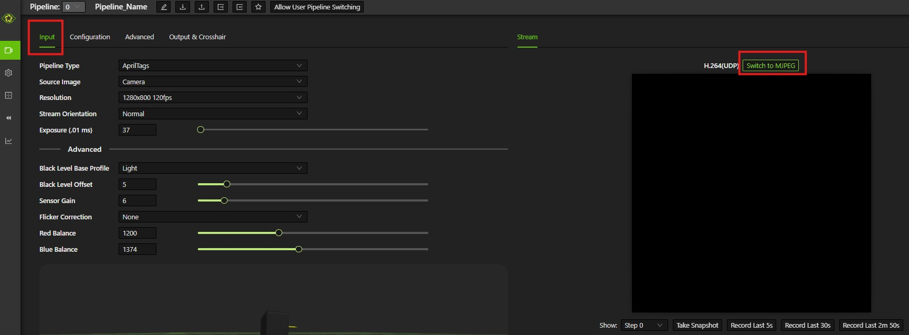
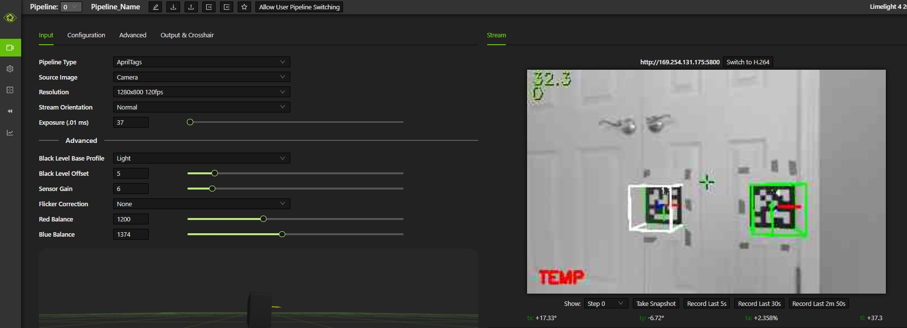

# Limelight

## Overview
This secion documents how to install, set up, and use the [Limelight](https://limelightvision.io/) smart camera with built-in coprocessor. It specifically discusses the Limelight 4 but is largely applicable to other models.

See the [Limelight 4 documentation](https://docs.limelightvision.io/docs/docs-limelight/getting-started/limelight-4) for detailed information about mounting, setup, and usage.

## Hardware Setup

To connect the Limelight to a real robot:

- Hardwire the Limelight to the PDP, PDH, or Mini PDP, using a 5A or 10A breaker
- Connect an ethernet cable from the radio on the robot to the Limelight

To connect the Limelight to a laptop for bench testing:

- Connect a dedicated USB-C power cable to the Limelight. (Power from a USB port on the laptop may be insufficient.)
- Connect an ethernet cable from the laptop to the Limelight

## Update Firmware and Drivers

Install the [Limelight Hardware Manager](https://docs.limelightvision.io/docs/resources/downloads)

Start the Hardware Manager and click `Find Devices on Local Network` 

After the ip addresses are listed, click on the ethernet address (in this case, 169.254.131.175) 

This will display the Limelight web interface in a browser window 

The firmware version number is shown in the upper right corner of the dashboard. In this case, it is version 2026.1. Check the [Limelight downloads page](https://docs.limelightvision.io/docs/resources/downloads) to see if there is a more recent version. If so, download it and do the following:

- Power off your Limelight
- Download the latest Limelight Hardware Manager and Limelight OS image
- Hold the config button while connecting a USB-C cable from your laptop to your Limelight. The config button is a small hole next to the lens on the front of the Limelight. Insert a paperclip or small tool inside the hole to press it.
- Open Limelight Hardware Manager
- Navigate to the `Flash OS` tab
- Select the OS image file and wait for extraction to complete
- Select target device. You might have to click `Refresh Device List` to see your device
- Select your Limelight device from the list
- Click `Flash Device` and wait for completion 
- Click `Install/Reinstall Drivers` in upper right
- Remove the USB cable after completion

## Limelight Settings
Start the Limelight web interface:

From the Hardware Manager  click `Find Devices on Local Network` 
After the ip addresses are listed, click on the ethernet address (in this case, 169.254.131.175) 
This will display the Limelight web interface in a browser window.

Go to the Settings tab to change the team number and Hostname 

Go to the `Pipelines` tab on the left to configure pipelines.

Click the Advanced tab at the top to set the `Full 3D Targeting` to `Yes` and to define the location and orientation of the Limelight camera relative to the center of the robot. These settings are `LL Forward`, `LL Right`, etc. Afterwards, apriltags will be detected and shown in the graphics window on the right. 

Click the `Input` tag at the top to configure the pipeline (exposure, etc.). On that tab, click `Switch to MJPEG`:  

This will give you a camera view along with detected april tags: 
