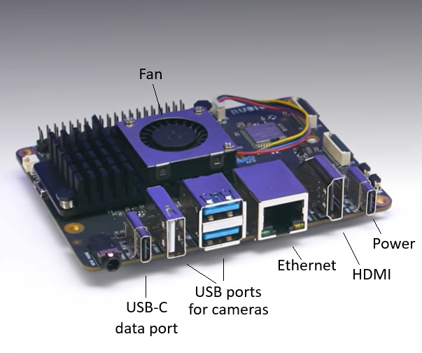
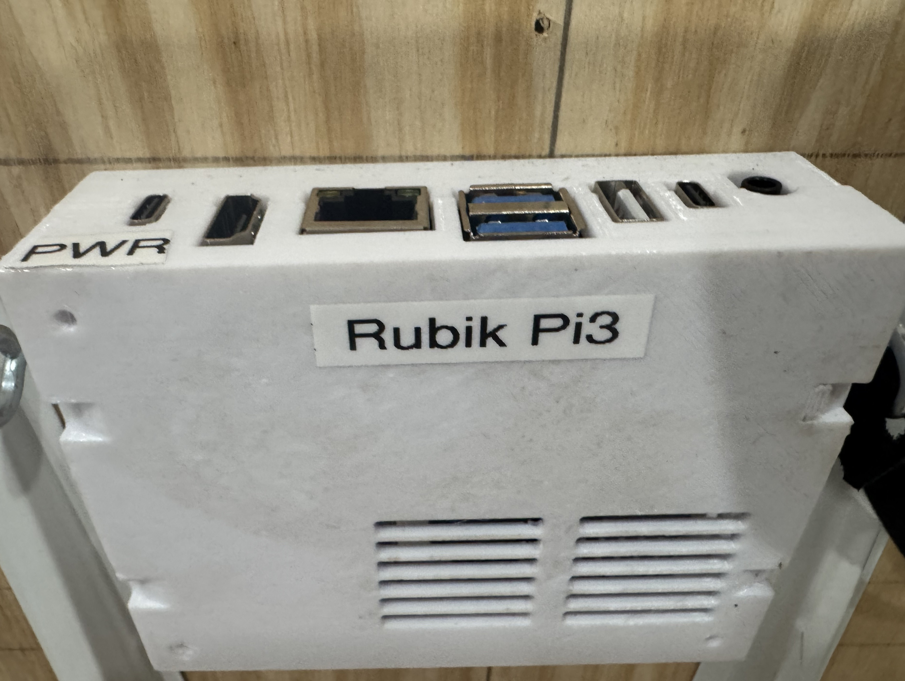
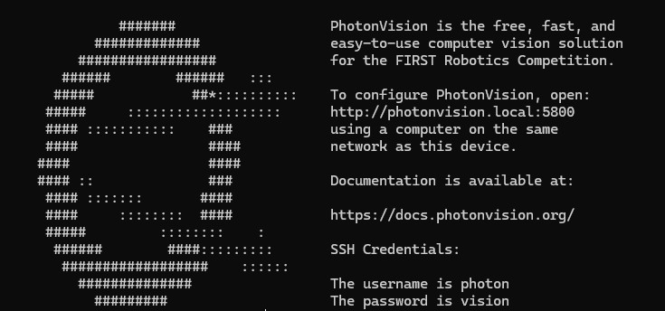
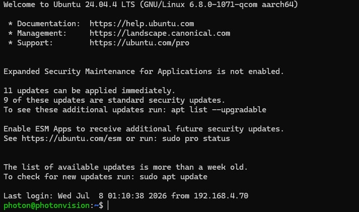
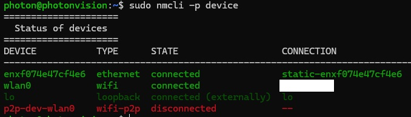
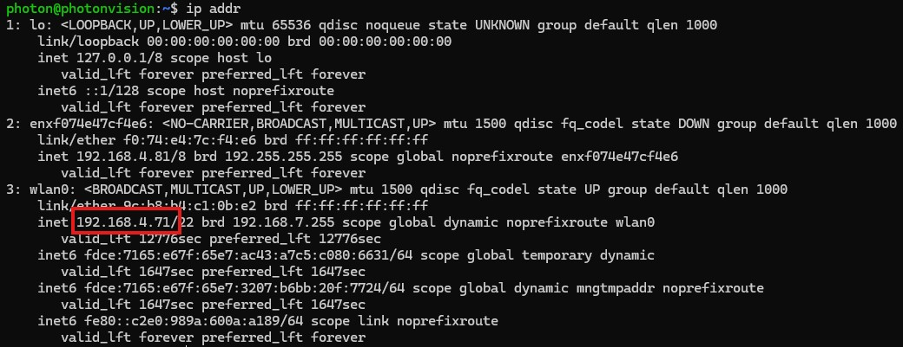
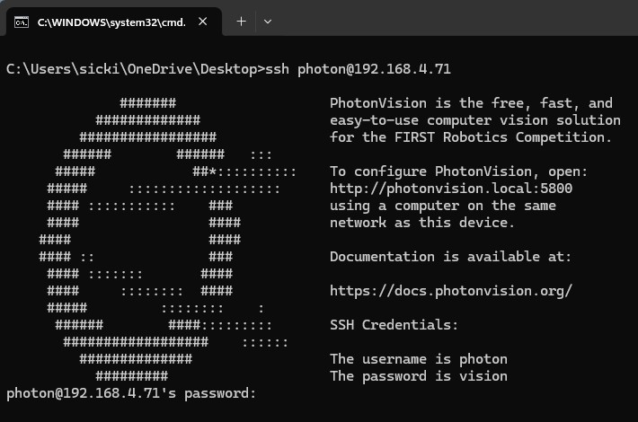
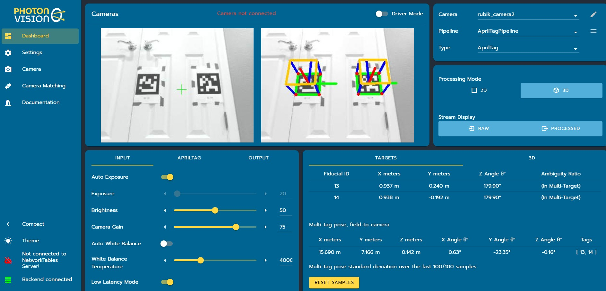
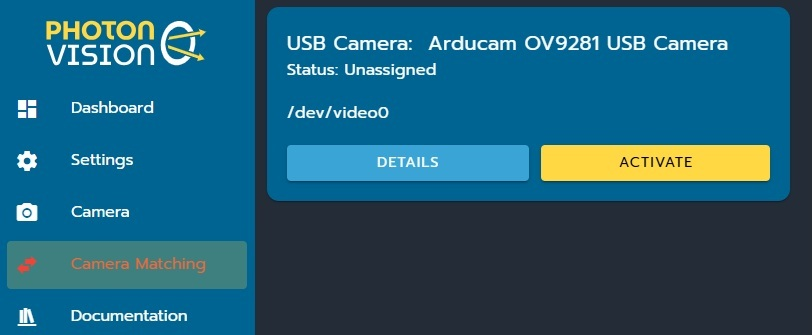

# Rubik Pi3 / PhotonVision

## Overview
This section documents how to install, set up, and use a vision system based on the Rubik Pi 3 coprocessor, which consists of the following:

- A [Rubik Pi 3 development board](https://www.thundercomm.com/product/rubik-pi/), which is a small, all-in-one computer on a circuit board specifically designed for AI, cameras, and embedded systems
- Cooling fan
- One to three USB cameras, such as the [Arducam OV9281](https://www.arducam.com/arducam-100fps-global-shutter-usb-camera-board-1mp-720p-ov9281-uvc-webcam-module-with-low-distortion-m12-lens-without-microphones-for-computer-laptop-android-device-and-raspberry-pi.html)
- 3d-printed cases for Rubik and cameras
- [PhotonVision](https://photonvision.org/) software running on the Rubik
- [PhotonLib](https://docs.photonvision.org/en/latest/docs/programming/photonlib/index.html) vendor dependency for WPILib programming

>Note that the MonarchVision application is mainly dependent on the PhotonLib programming interface and the functionality provided by PhotonVision. It is possible to use different cameras and potentially a different coprocessor hosting PhotonVision with minimal impact on MonarchVision.

Some of the benefits of the Rubik Pi 3 / PhotonVision system:

- **Cost Effective** - A single Rubik Pi 3 can support up to three cameras which makes for a very cost-effective solution. Even a single camera set-up is much less expensive than one Limelight 4.
- **Odometry Confidence** - Multiple camera installation improves the likelihood of continually having line of sight to at least one april tag on the field so that  odometry accurately reflects the robot's position and orientation on the field.
- **Object Detection** - Rubik Pi 3 / PhotonVision supports object detection out of the box, having been trained on the 2026 FRC game pieces (fuel balls). It's likely that it will support object detection for future seasons as well.

## Resources

- [Rubik Pi 3 from Thundercomm](https://www.thundercomm.com/rubik-pi-3/en/docs/about-rubikpi/)
- [Rubik Pi documentation for FIRST](https://first-rubik.github.io/)
- [STL files for Rubik Case](https://first-rubik.github.io/docs/Case-STL-Files)
- [PhotonVision](https://docs.photonvision.org/en/latest/index.html)


## Rubik Hardware Setup
The Rubik Pi 3 development board with installed fan looks like this: 

See the [Rubik Pi Setup documentation](https://first-rubik.github.io/docs/Intro) for detailed information about how set up the Rubik Pi3 hardware and install PhotonVison. This documentation is specifically for FIRST Robotics teams and covers the following topics:

- Install fan
- Connect power
- Install PhotonVision
- Print enclosing case

The Rubik Pi 3 with case looks like this: 

## Accessing Rubik
After the above installation, Rubik will be running the Ubuntu version of Linux. To initally access the operating system, connect your laptop to the USB power port on the Rubik. Also connect a monitor to the HDMI port and keyboard (and optionally mouse) to the USB port(s). You will then see the Ubuntu login prompt:

Here is the initial Ubuntu prompt after logging in: 

It is much more convenient to access the Rubik remotely via wifi than to plug in a monitor and keyboard. To do that, do the following in Ubuntu:

Turn on the radio
```
nmcli radio wifi on
```

Get a list of available wifi connections
```
nmcli dev wifi list
```

Connect to wifi
```
sudo nmcli dev wifi connect <wifi name> password <wifi password>
```

Verify the wifi connection and status
```
sudo nmcli -p device
```



Get the ip address of the wifi connection. In this case, the ip address is 192.168.4.71:
```
ip addr
```


To ensure that the connection is active:
```
ping yahoo.com
```

From now on you can remotely access the Rubik using wifi by establishing an SSH connection from your laptop. On Windows, open a cmd prompt and type the following. (Change the ip address as needed.)  For convenience, you can create a bat file on Windows (rubik_ssh.bat) to automatically start up the SSH session.
```
ssh photon@192.168.4.71
```


>Sometimes you get a stale ethernet connection, especially when changing the network connectivity (switching between hardwire and wifi). If repeating the above instructions don't resolve the issue, search online for detailed steps to reset the default connection.


## PhotonVision Settings
The PhotonVision dashboard, like the Limelight dashboard, is where you define cameras, configure them, set up pipelines, etc. To display the dashboard from your laptop type the following URL into a browser (changing the ip address of the Rubik as needed). It's a good idea to have a favorite or shortcut for this.
```
http://192.168.4.71:5800/
```

Use the PhotonVision dashboard to define and calibrate up to three USB cameras. After connecting a camera to one of the USB ports on the Rubik, select the Camera Matching tab which will identify the new camera as being unassigned. (See screen shot below.) Click Activate.

You must nickname your cameras in PhotonVision to ensure that every camera has a unique name. This is how you will identify cameras in robot code. Use the Dashboard tab to edit the camera name, to define the pipelines (AprilTag, ObjectDection, etc.), and to fine-tune camera settings (exposure, brightness, etc.).

Use the Camera tab to define the type of camera, and to focus and calibrate it.

>Note: unlike Limelight, you do not use the dashboard to define the camera's position on the robot. That is done in the robot code.
